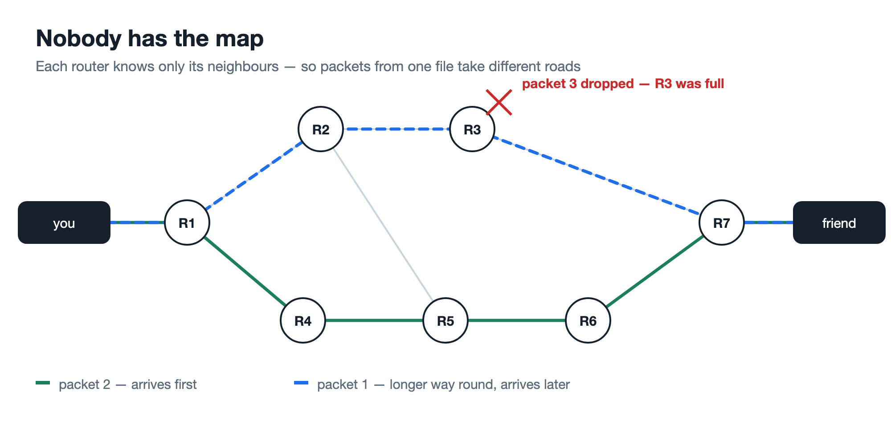
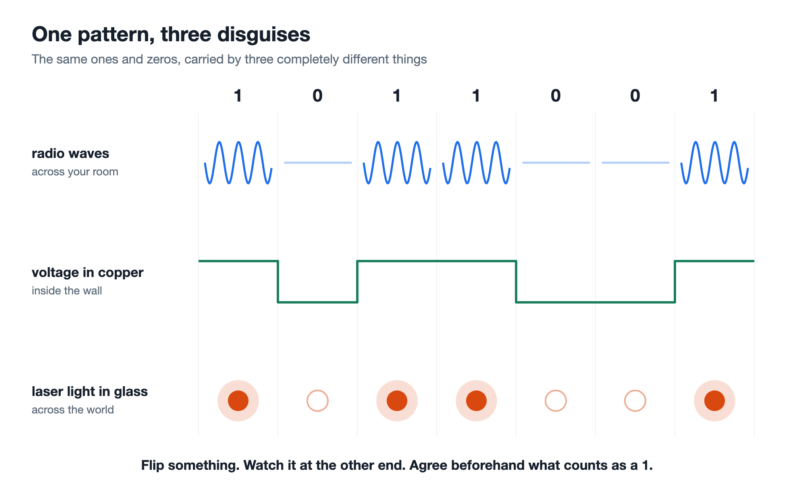
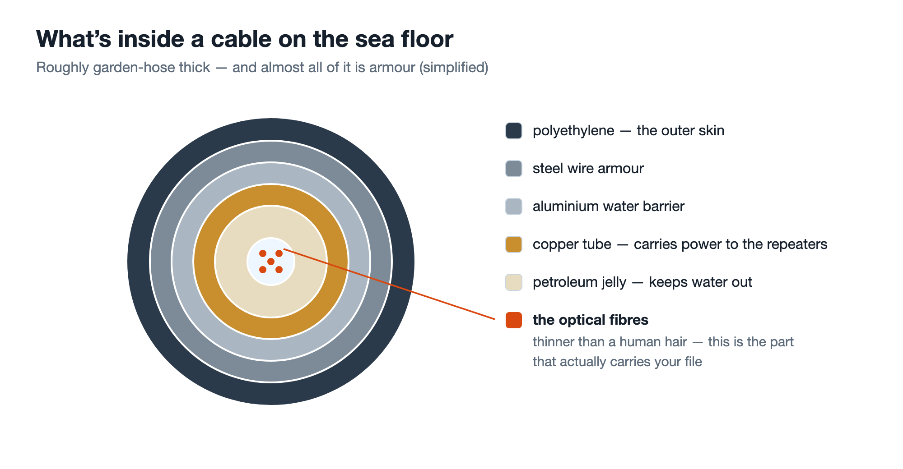
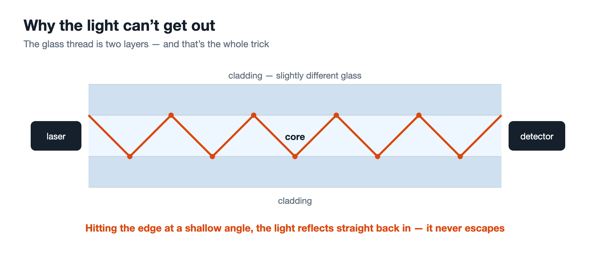

# What actually travels when you send someone a file?

A friend was looking at PeerSend, a file-sharing app I built where the file goes straight from your browser to someone else's. Nothing gets uploaded. No server keeps a copy.

He asked how it was getting there. I said WebRTC opens a direct connection between the two browsers. He nodded, and then asked again, differently:

"Yeah, but how is it *going*?"

I couldn't answer. I'd said the technical thing and it had explained nothing. Because there is no pipe between my laptop and his. Nothing connects them. So what, physically, travels?

I went looking. What I found is one of the strangest things I know.

## First: what is data, actually?

Start with the file.

A photo on your laptop feels like a thing. It isn't. It's a pattern of ones and zeros — a very long sequence of them, and nothing else. It isn't stored as a picture anywhere. It's stored as a number so long you'd need weeks to read it out loud.

Every file is like this. A song, a PDF, a video — all just long patterns of ones and zeros. The only difference between a song and a spreadsheet is how a program decides to read the pattern.

Hold onto that. It matters later, more than it looks like it should.

## Nobody has the map

So we need to move a pattern of ones and zeros from my machine to yours.

It doesn't go as one piece. It gets chopped into thousands of small chunks called **packets**. Each packet carries a fragment of the file, a destination address, and a number saying which piece it is — page 1, page 2, page 3.

Then each packet is released into the network on its own.

Here's what surprised me most. The internet is a mesh of routers, each wired to a few others. And a router does not know how to reach your friend. It can't — there are billions of possible destinations, and it's handling millions of packets a second.

What a router actually knows is its immediate neighbours, and a rough sense of which neighbour lies *toward* a given range of addresses. It glances at the packet, picks a neighbour, hands it over, and forgets the packet ever existed.

No machine anywhere holds the full route. There is no map. The path your file takes is simply what emerges when twenty or thirty routers each make one local, selfish decision in a row.

Which means packets from the same file can travel different roads:

Nobody planned that split. Your file arrives shuffled.

## The internet promises you nothing

It gets worse.

Say a router is busy and its memory is full. A packet arrives and there's no room for it.

It throws the packet away.

It doesn't warn anyone. It doesn't apologise. It keeps no record. Your data is simply gone and nobody is told.

This isn't a fault. It's the design. The internet's promise is officially called **best effort**, which means what it sounds like: *I'll try. No guarantees.* Not delivery. Not order. Not anything.

That was the moment the whole thing flipped for me. I'd assumed reliability lived somewhere inside the internet. It doesn't. The middle is dumb and unreliable on purpose — and that's exactly what makes it cheap, fast, and very hard to kill.

## So the two ends build reliability themselves

The trick fits in one sentence: **number everything, confirm everything, resend anything unconfirmed.**

Every packet carries a sequence number, so the receiver can sort them back into order no matter how shuffled they arrive. Each time one lands, the receiver sends back a tiny "got number 4". The sender keeps a copy of every packet until that confirmation comes — and if it never comes, it assumes the worst and sends the copy again.

That's the entire mechanism.

Gaps get noticed because a number is missing. Losses get repaired because the sender still has a copy. Shuffling gets undone by sorting.

A network that guarantees nothing, plus patient bookkeeping at both ends, produces a file that arrives perfectly intact. The reliability you experience isn't a property of the internet at all. It's something two machines agreed to do on top of it.

This bookkeeping has a name. Most of the web uses **TCP**, quietly numbering and confirming every time you load a page. PeerSend's browser-to-browser connection uses a different one called **SCTP**, wrapped in encryption. Different protocol, same job. The acronyms don't matter; the idea underneath is identical.

## But none of that answers the question

Everything so far is the *logical* story — pieces, addresses, numbers, confirmations. It's clever, but it's paperwork. You could do all of it with envelopes and a pen.

It still doesn't explain what my friend was asking.

*"Yeah, but how is it going?"*

Because underneath the numbering and the sorting, something has to physically carry those ones and zeros across the real world. Through walls, under streets, across countries. That isn't bookkeeping. That's physics.

We once worked out how to catch light and freeze it in place. That's photography, and it still feels like a magic trick if you think about it too hard.

What we did next was work out how to *shape* light, and throw it around the planet.

## What is actually moving

Forget computers for a second.

Imagine you're standing on a hilltop at night with a torch. A friend is on the next hill, watching. Before you start, the two of you agree on one rule: **light on means 1, light off means 0.**

That's all you need. You can now send them anything — any file, any photo, any song — because everything is just ones and zeros. It would take you the rest of your life to send a single holiday photo, but it would genuinely work.

That's the whole secret. Everything below is that same torch, waved faster.

Because a 1 isn't an object you send anywhere. **It's a difference you agreed to notice.** Anything you can flip between two states, and reliably tell apart at the far end, can carry data. Loud and quiet. Hot and cold. Light and dark. The universe doesn't care which you pick, as long as both sides agreed beforehand.

So watch your file leave the building — and notice it's the same torch every time:

**Across your room, the thing being flipped is a radio wave.** Your laptop and your router are shouting at each other in a kind of light your eyes can't see — filling the room, passing through the walls, passing through you.

**Inside the wall, the thing being flipped is electricity.** Voltage pushed high, then low, then high again, like a light switch flicked millions of times a second, with someone at the other end of the wire watching the bulb.

**In fibre, it's an actual laser.** A real beam of light, switched on and off billions of times a second, down a thread of glass.

Radio waves. Electricity. Light. Three completely unrelated physical things — and the same trick every single time. Flip something. Watch it at the other end. Agree in advance what counts as a 1.

And here's where it stops feeling like engineering.

Nothing physical makes the whole trip. Not one photon. Not a single electron. At every boundary — laptop to router, router to wall, copper to glass — your file is *read*, and then *built again from nothing* in a completely different form.

Your file never really moves. It is **rebuilt from scratch, over and over, at every step across the planet.** What lands on your friend's laptop shares not one physical thing with what left yours. It's the same pattern, and nothing else.

## Across the ocean

Your friend is on another continent. Between you is an ocean.

Almost everyone guesses satellites. It isn't satellites. The overwhelming majority of data crossing oceans travels through **cables lying on the sea floor** — real cables, kilometres down, in the cold and the dark.

The details are better than the headline. The deep-water sections are about as thick as a garden hose, and nearly all of that is armour and waterproofing. The part carrying your data is a few strands of glass at the very centre, each thinner than a human hair. They're laid by ships that sail for months, unspooling cable off an enormous drum behind them.

Light fades over distance, so every 50 to 100 kilometres a repeater boosts the signal along — powered from land, working away in total darkness in the middle of the Atlantic.

And they break. Ship anchors, fishing trawlers. When one goes, a repair ship sails out, hooks the cable up off the seabed, splices it, and lowers it back down.

## Inside the glass

So how does light stay inside a glass thread for thousands of kilometres?

At one end sits a laser, flashing on and off billions of times a second. At the other, a detector watching for the flashes and reading the pattern back out. Not visible light — infrared, just past what your eyes can see.

The thread is two layers: an inner core, wrapped in a coating of slightly different glass. When light inside the core strikes that boundary at a shallow angle, it doesn't pass through. It reflects entirely back inside. So the light ricochets its way along, following every bend, unable to escape.

And one fibre carries many colours of light at the same time, each colour holding its own separate stream of data, pulled apart again by colour at the far end.

## So why is it free?

My friend had a second question: how is none of this costing anybody anything?

The internet isn't owned by anyone. It's around 80,000 separate networks — ISPs, companies, universities — that agreed to plug into each other. Sometimes a small network pays a larger one to carry its traffic onward. Just as often, two networks of similar size connect and carry each other's traffic for nothing, because each gets about as much as it gives and billing each other would cost more than it saved.

But the real reason is simpler: **the cable is lit whether you use it or not.** The lasers are already flashing. The routers are already powered. Your file costs the network essentially nothing extra.

So what are the file-sharing services you're used to actually charging for? Not the moving — **storage.** Your file sitting on their disks for days, on machines drawing power whether anyone downloads it or not, while they sit in the middle paying for the traffic twice: once as you upload, once as your friend downloads.

PeerSend pays for neither, because it never holds your file at all.

## One last thing

If both people happen to be on the same wifi, PeerSend notices, and the file goes laptop → router → laptop. It never touches the internet. Same code, same everything — it just crosses a room instead.

The app has no idea which of the two happened.

That's what I couldn't explain to my friend. You click send, and your file becomes radio waves in your room, then electricity in the wall, then light — light that dives into an ocean, races along a glass thread thinner than your hair, is amplified in total darkness three kilometres down, comes ashore on another continent, and turns back into a file.

In about a second. And nobody charges you for it.

---

**PeerSend is at [peersend.app](https://peersend.app)** — open a room, share the link, send someone a file. Nothing you send ever touches my server. I built it as my Master's project, and the question in this post is the one I couldn't answer when a friend asked me how it worked.

Next time I'll go one layer up: how two browsers find each other in the first place, when neither of them has an address anyone can dial. That part has its own strangeness.
